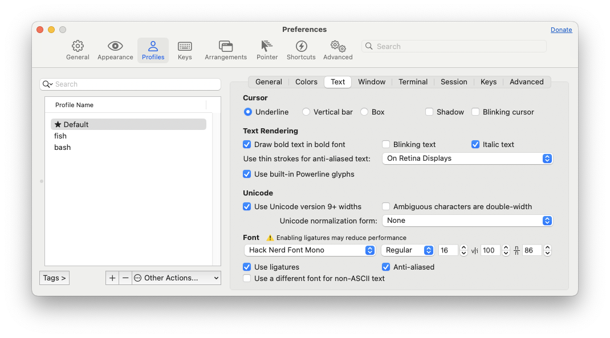
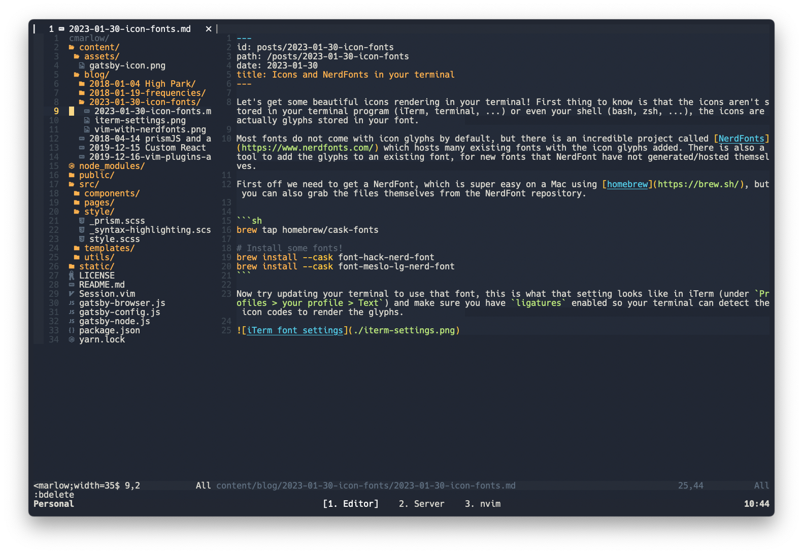
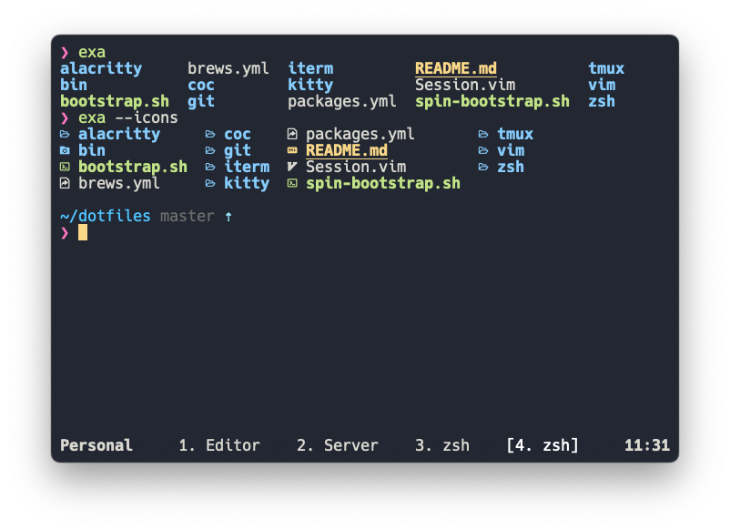

Let's get some beautiful icons rendering in your terminal! First thing to know is that the icons aren't stored in your terminal program (iTerm, terminal, ...) or even your shell (bash, zsh, ...), the icons are actually glyphs stored in your font.

Most fonts do not come with icon glyphs by default, but there is an incredible project called [NerdFonts](https://www.nerdfonts.com/) which hosts many existing fonts with the icon glyphs added. There is also a tool to add the glyphs to an existing font, for new fonts that NerdFont have not generated/hosted themselves.

First off we need to get a NerdFont, which is super easy on a Mac using [homebrew](https://brew.sh/), but there are several ways to [grab the files from the NerdFont repository](https://github.com/ryanoasis/nerd-fonts#font-installation).

```sh
brew tap homebrew/cask-fonts

# Install some fonts!
brew install --cask font-hack-nerd-font
brew install --cask font-meslo-lg-nerd-font
```

Now try updating your terminal to use that font, this is what that setting looks like in iTerm (under `Profiles > your profile > Text`) and make sure you have `ligatures` enabled so your terminal can detect the icon codes to render the glyphs.



Now that you have fonts and can (supposedly) render the font with icons, we need to tell our tools to make use of them.



In this case I needed to [add 2 extra plugins for my vim filetree plugin](https://github.com/perrupa/dotfiles/commit/7c3433d7a69f967e46a94815a6a86157ecd08b0d) to render icons. This can vary tool-by-tool, some will support them immediately while other may need some extra config or plugins to make use of them. Some commands may simply need a commandline argument or a config flag to be set. For example: The `exa` tool requires a `--icons` flag to be included.


