## Italian form over Canadian function

I'm a sucker for a bike with straight, round tubes and classic lines. A bike that looks like a bike, even if its use doesn't fit its intended purpose.

This is my 2016 Cinelli Vigorelli Ellisse Magica, and the horrific things I've done to it.

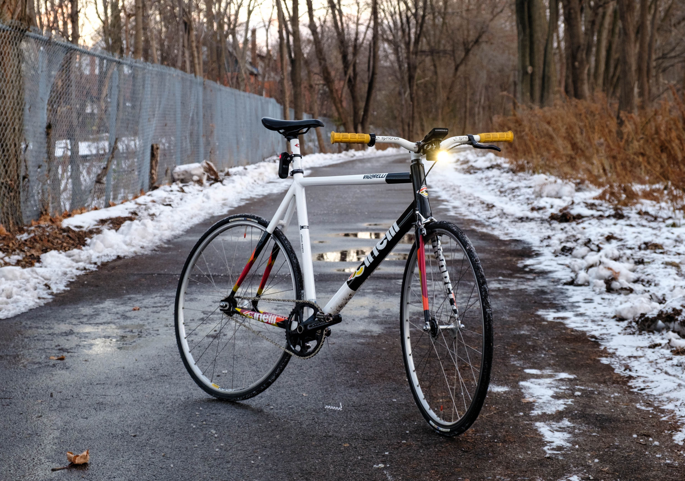

## She's never ridden outside

I got this Cinelli Vigorelli from a former track cyclist who claimed the bike had only ever been ridden on the track.

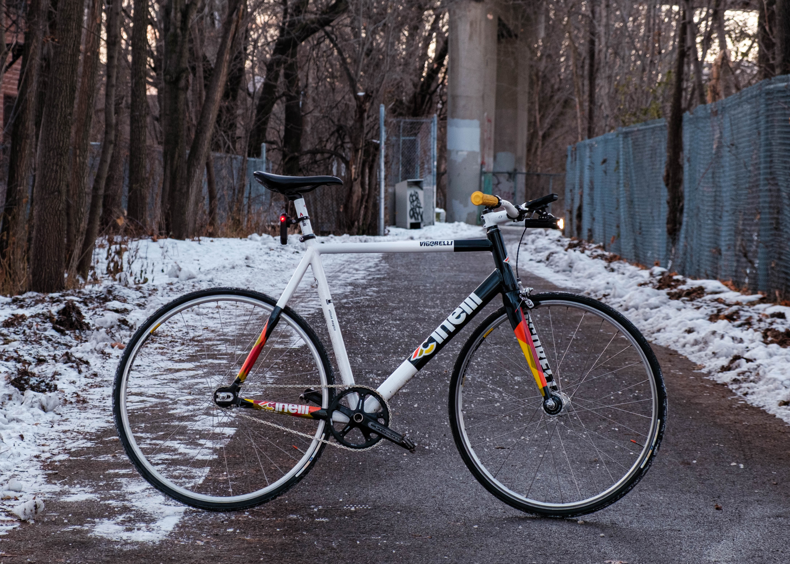

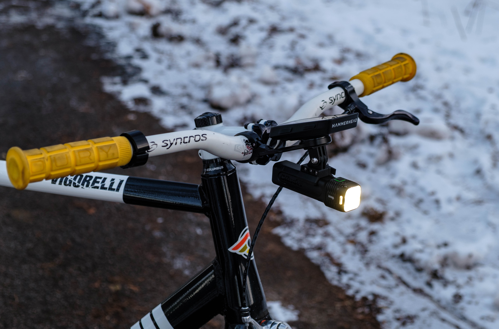

The entire cockpit is a parts-bin-special: from the white Syncros bars my friend won in a race, to the bell that didn't fit my gravel bike. 

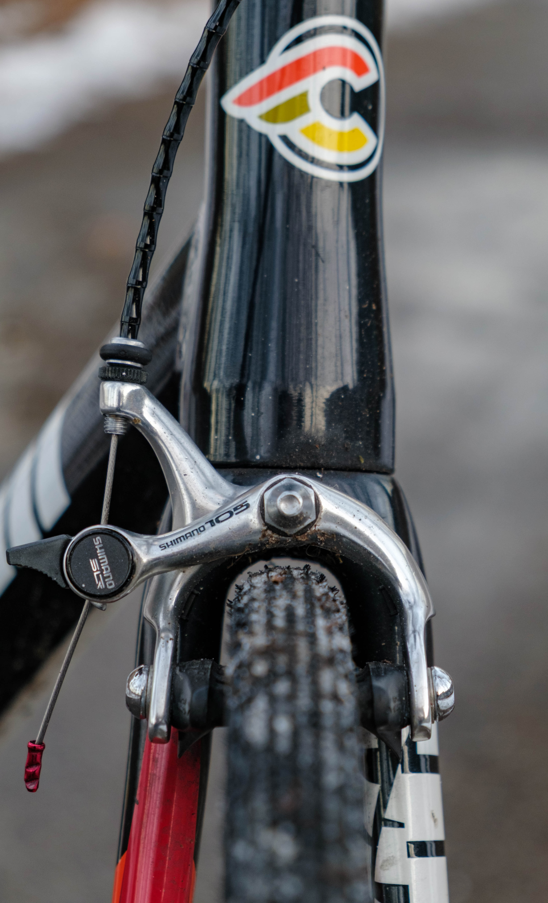

> Check out that tire clearance 🤌

The front fork doesn't originally come drilled for a brake. I had my friends at [Downtown Bike Hounds](https://www.bikehounds.ca/) help me out by popping out the pre-drilled plug so I could mount a beauty NOS Shimano brake I had. I love the look of this segmented brake housing, and think I nailed the color matching on that cable-end. 💅

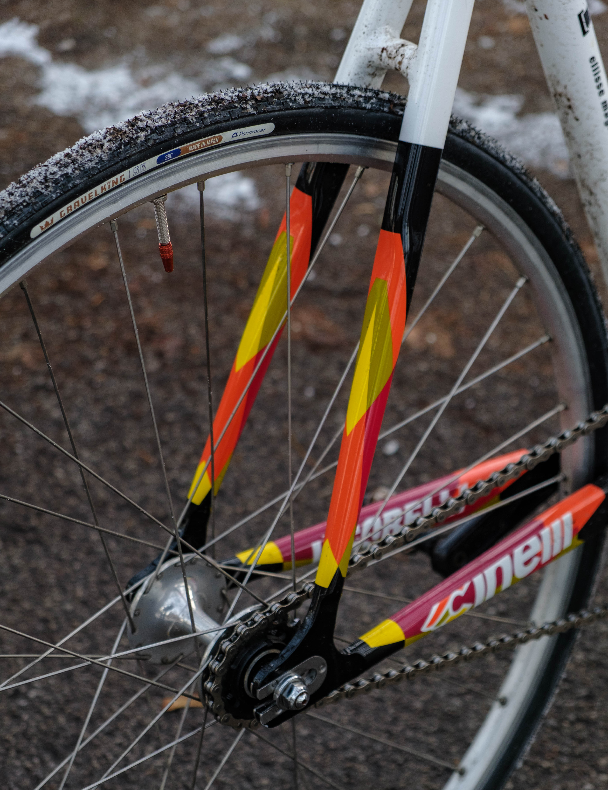

> Japanese rubber in widths you can't even comprehend

I had to order these 28mm Panaracer Gravelking SKs from Japan because no local distributors carried any knobbly tires in 28mm. 
Shout outs to [Blue Lug](https://global.bluelug.com/) for the Panaracer hookup (they even have [Gravelkings in 26mm](https://global.bluelug.com/panaracer-gravel-king-sk-tire-black-01.html)!!! 😮)

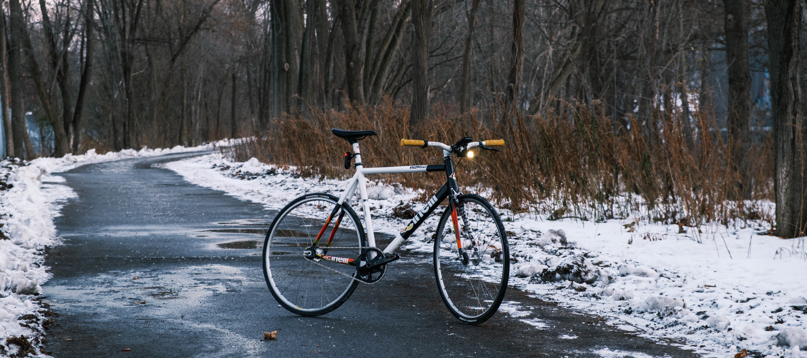

For wheels, we've got some Dura-ace track hubs laced to Mavic Open Pro rims, I got them for a deal on Facebook Marketplace.

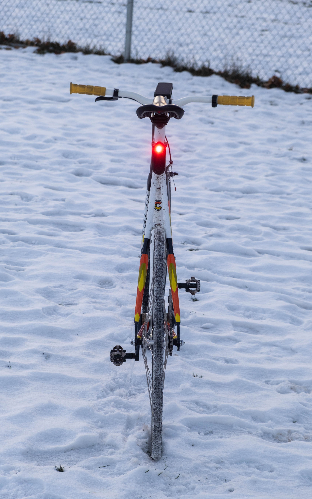

> Call me by my name...

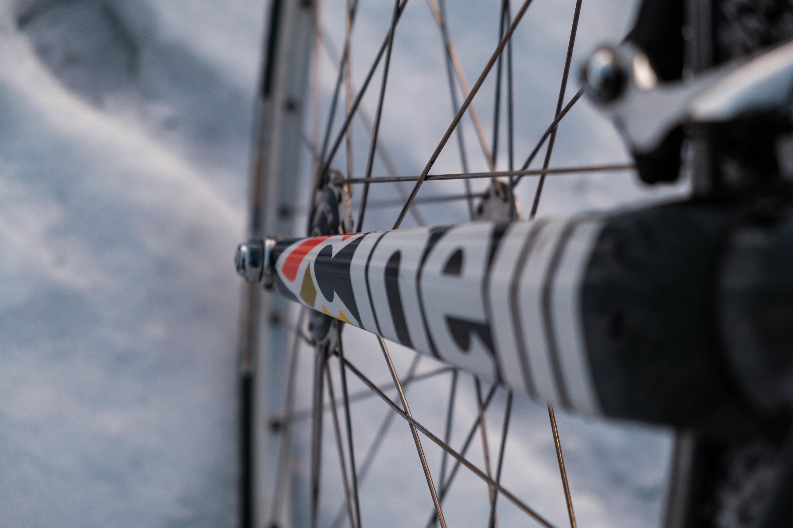
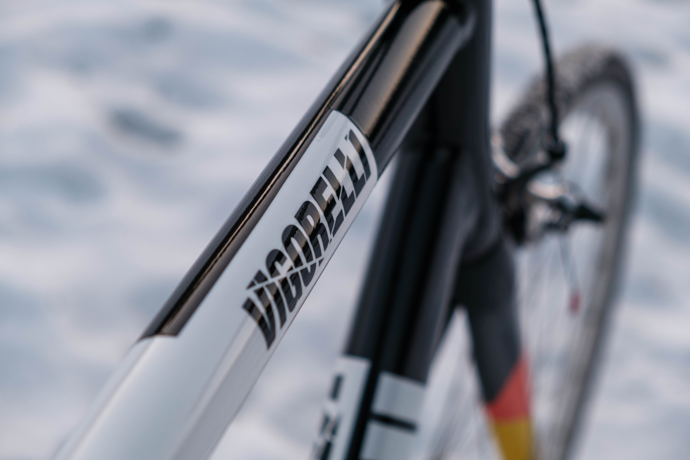
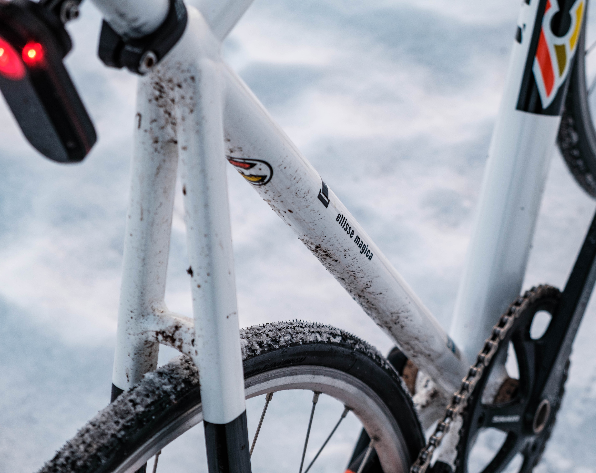

> Beautiful, impractical and fun.

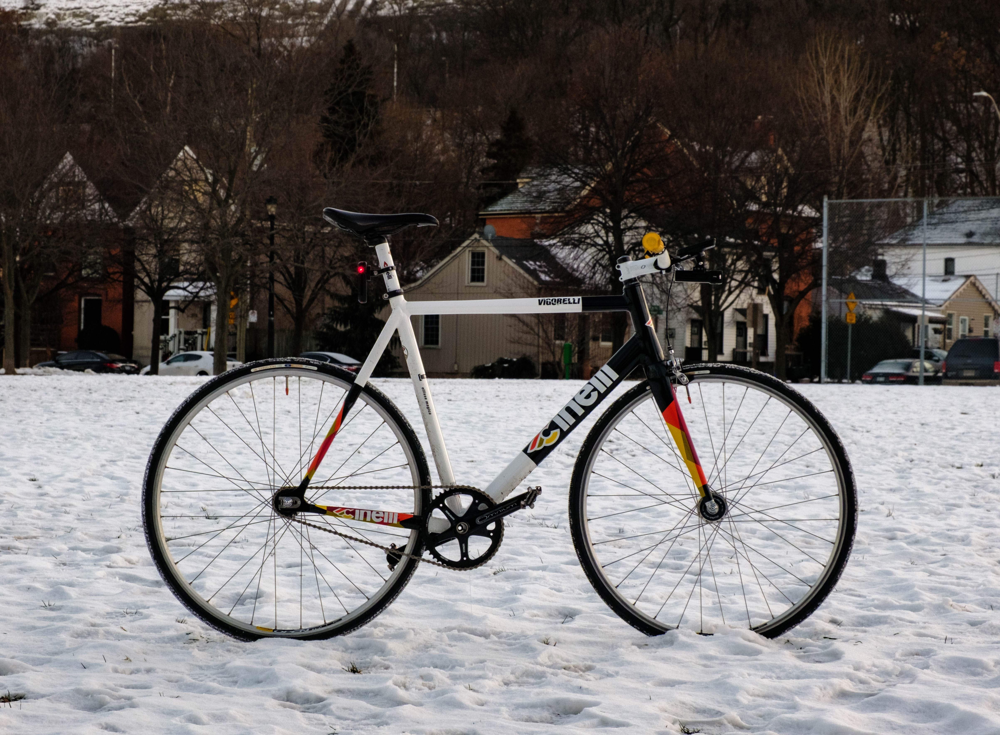
